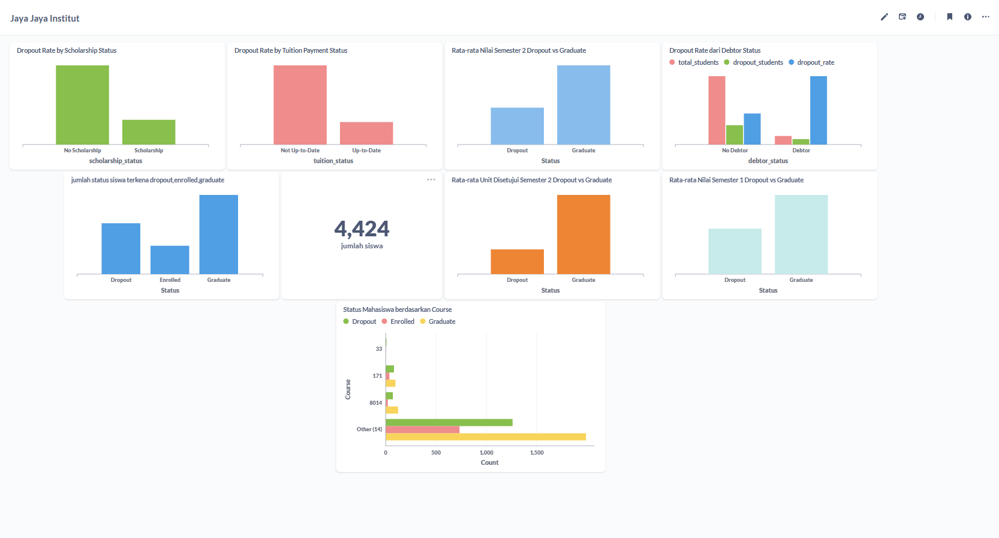

# Proyek Akhir: Menyelesaikan Permasalahan Perusahaan Jaya Jaya Institut

## Business Understanding

Jaya Jaya Institut adalah institusi pendidikan tinggi yang telah berdiri sejak tahun 2000 dan telah menghasilkan banyak lulusan berkualitas. Namun, institusi ini menghadapi tantangan serius berupa tingginya angka mahasiswa yang dropout (tidak menyelesaikan studi) — dari data yang tersedia, sekitar 32% mahasiswa berstatus Dropout, hampir sepertiga dari total mahasiswa ,tingginya angka dropout ini berdampak pada reputasi institusi, efektivitas proses pembelajaran, serta efisiensi alokasi sumber daya (dosen, fasilitas, beasiswa). Selama ini, deteksi mahasiswa yang berisiko dropout umumnya dilakukan secara reaktif setelah nilai/kehadiran memburuk atau setelah mahasiswa benar-benar berhenti kuliah. Hal ini membuat pihak akademik kehilangan waktu emas untuk melakukan intervensi (bimbingan konseling, keringanan biaya, pendampingan akademik) sebelum mahasiswa benar-benar keluar,oleh karena itu, dibutuhkan pendekatan data-driven untuk mengidentifikasi mahasiswa yang berpotensi dropout sedini mungkin berdasarkan data demografis, sosial-ekonomi, dan performa akademik semester awal, sehingga pihak institusi dapat memberikan intervensi yang tepat waktu dan tepat sasaran.

### Permasalahan Bisnis

- Institusi belum memiliki sistem yang dapat memprediksi secara dini mahasiswa mana yang berisiko tinggi untuk dropout.
- Institusi belum memiliki visibilitas menyeluruh (dalam bentuk dashboard) terhadap faktor-faktor yang paling memengaruhi performa dan kelulusan mahasiswa, sehingga sulit menentukan kebijakan intervensi yang efektif.
- Belum diketahui secara jelas faktor-faktor apa saja (misalnya status pembayaran uang kuliah, nilai semester awal, status beasiswa, status pernikahan, usia saat masuk, dll.) yang paling berkontribusi terhadap keputusan mahasiswa untuk dropout.

### Cakupan Proyek

- eksplorasi dataset performa mahasiswa (36 atribut: demografi, sosial-ekonomi, riwayat akademik sebelumnya, performa semester 1 & 2), pembersihan data, dan penanganan fitur kategorikal maupun numerik.
- eda analisis pola dan hubungan antar variabel terhadap status dropout, misalnya pengaruh nilai semester awal, status tunggakan biaya kuliah, status beasiswa, dan usia saat masuk.
- membangun model machine learning klasifikasi (Random Forest, SVC, LightGBM) untuk memprediksi status mahasiswa (Dropout / Enrolled / Graduate), termasuk evaluasi model menggunakan accuracy, precision, recall, dan f1-score, serta analisis feature importance untuk mengetahui faktor paling berpengaruh.
- membuat dashboard visual (menggunakan Metabase/Tableau/Looker Studio) yang menampilkan metrik-metrik kunci performa mahasiswa agar mudah dipantau oleh pihak Jaya Jaya Institut secara berkelanjutan.
- membangun prototype sistem prediksi berbasis Streamlit (app.py) yang dideploy ke Streamlit Community Cloud, sehingga tim akademik dapat memasukkan data seorang mahasiswa dan langsung mendapatkan
- merumuskan kesimpulan dari hasil analisis serta rekomendasi tindakan konkret yang dapat diambil institusi untuk menurunkan angka dropout.

### Persiapan

Sumber data:
dataset:[(https://github.com/dicodingacademy/dicoding_dataset/tree/main/students_performance)]

Untuk menjalankan proyek, pastikan Python dan Docker Desktop sudah terinstall.

Setup environment:
Setelah seluruh library berhasil di-install, buka file `notebook.ipynb` menggunakan Visual Studio Code dan jalankan setiap cell untuk melakukan proses analisis data dan pemodelan.

Model final (`model.pkl`) beserta script `prediction.py` disediakan agar HR dapat menjalankan prediksi attrition tanpa perlu membuka notebook.

Dashboard dibuat menggunakan Metabase versi v0.46.4.
Pastikan Docker Desktop sudah terinstall dan sedang berjalan.
Jalankan container Metabase dengan perintah:

```bash
docker run -d -p 3000:3000 --name metabase metabase/metabase:v0.46.4
docker cp metabase.db.mv.db metabase:/metabase.db/metabase.db.mv.db
docker restart metabase
http://localhost:3000
```

- Anaconda

```bash
conda create --name main-ds python=3.9
conda activate main-ds
pip install -r requirements.txt
```

- Install pipenv:

```bash
pip install pipenv
pipenv install
pipenv shell
pip install -r requirements.txt

```

## Business Dashboard



- Dropout Rate by Scholarship Status
  Bar chart yang bandingin siswa yang tidak dapat beasiswa vs dapat beasiswa. Dari gambar, batang "No Scholarship" lebih tinggi artinya jumlah dropout dari kelompok tanpa beasiswa lebih banyak dibanding yang punya beasiswa. Insight kasarnya: beasiswa mungkin berkaitan dengan siswa yang lebih "bertahan" kuliah.

- Dropout Rate by Tuition Payment Status
  Ini bandingin siswa yang bayar SPP tidak lancar (Not Up-to-Date) vs yang lancar (Up-to-Date) Yang telat/tunggak bayar SPP jumlah dropoutnya jauh lebih tinggi. Ini insight yang cukup kuat biasanya masalah finansial adalah salah satu prediktor dropout.

- Rata-rata Nilai Semester 2 Dropout vs Graduate
  Ini bandingin rata-rata nilai akademik semester 2 antara siswa yang akhirnya dropout vs yang lulus. Yang lulus nilainya rata-rata lebih tinggi/masuk akalperforma akademik berhubungan dengan kelulusan.

- Dropout Rate dari Debtor Status
  Ini agak lebih ramai karena ada 3 informasi sekaligus total siswa, jumlah siswa dropout, dan dropout rate dipecah berdasarkan status Debtor siswa yang punya tunggakan atau hutang vs No Debtor. Ini semacam versi lebih detail dari chart tuition status tadi.

- Jumlah status siswa Dropout,Enrolled,Graduate
  Ini ringkasan paling dasar dari total 4.424 siswa,berapa yang statusnya dropout, masih aktif,atau sudah lulus. Ini biasanya jadi pusat cerita dashboard-nya.

- Rata-rata Unit Disetujui Semester 2 & Rata-rata Nilai Semester 1
  Dua chart ini mirip poin nomor 3, tapi dilihat dari metrik akademik lain jumlah SKS/unit yang disetujui,dan nilai semester 1.Konsisten menunjukkan siswa dropout performanya lebih rendah dibanding yang graduate.

- Status Mahasiswa berdasarkan Course bawah
  Ini horizontal bar chart yang pecah data per jurusan/program studi course, nunjukin proporsi Dropout hijau,Enrolled merah muda, Graduate kuning di tiap jurusan. Ini berguna buat lihat jurusan mana yang dropout rate-nya paling tinggi.

link menjalankan dashord:[http://localhost:3000]

## Menjalankan Sistem Machine Learning

Prototype sistem machine learning pada proyek ini dibangun menggunakan Streamlit, dengan nama aplikasi Jaya Jaya Student Insight. Aplikasi ini berfungsi untuk memprediksi status mahasiswa — apakah Dropout, Enrolled, atau Graduate — berdasarkan data profil, riwayat pendidikan, performa akademik semester 1 & 2, serta kondisi ekonomi yang diinput oleh pengguna pihak akademik kampus.

link Streamlitnya:[https://jaya-jaya-institut-dicoding-anthony-saputra.streamlit.app/]

## Conclusion

royek ini berhasil menjawab permasalahan bisnis yang diangkat oleh Jaya Jaya Institut, yaitu tingginya angka mahasiswa yang dropout. Dari hasil eksplorasi data, ditemukan bahwa dari total 4.424 mahasiswa, sebanyak 32,12% berstatus Dropout, 17,95% Enrolled, dan 49,93% Graduate mengonfirmasi bahwa hampir sepertiga mahasiswa tidak berhasil menyelesaikan studinya, sejalan dengan latar belakang masalah yang diangkat di awal proyek.
Melalui tahap EDA, ditemukan beberapa pola yang konsisten sebagai indikator risiko dropout, di antaranya:

- Performa akademik semester awal (jumlah mata kuliah yang disetujui dan rata-rata nilai di semester 1 & 2) menjadi pembeda paling jelas antara mahasiswa yang dropout dan yang lulus.
- Status pembayaran uang kuliah (tuition fee) dan status tunggakan (debtor) sangat berkaitan dengan dropout mahasiswa dengan pembayaran tidak lancar atau berstatus debitur menunjukkan proporsi dropout yang jauh lebih tinggi.
- Kepemilikan beasiswa berasosiasi dengan tingkat bertahan studi yang lebih baik dibanding yang tidak memiliki beasiswa.
- Terdapat variasi tingkat dropout yang cukup besar antar program studi (course), menunjukkan bahwa risiko dropout tidak merata di semua jurusan.,

dibangun tiga model klasifikasi (Random Forest, LightGBM, dan SVM) untuk memprediksi status mahasiswa ke dalam tiga kelas: Dropout, Enrolled, dan Graduate. Berdasarkan hasil evaluasi pada data uji, Random Forest dipilih, Model ini kemudian disimpan (model/student_dropout_model.pkl) dan diintegrasikan ke dalam prototype aplikasi Streamlit (Jaya Jaya Student Insight), sehingga pihak akademik dapat memasukkan data seorang mahasiswa dan langsung memperoleh prediksi status beserta tingkat keyakinan model.
Analisis feature importance dari model Random Forest juga memperkuat temuan EDA, di mana fitur-fitur dengan pengaruh terbesar terhadap prediksi adalah jumlah dan nilai mata kuliah yang disetujui di semester 1 & 2, nilai kelulusan (admission grade), usia saat mendaftar, nilai kualifikasi sebelumnya, serta status pembayaran uang kuliah.
Secara keseluruhan, kombinasi antara dashboard monitoring dan sistem prediksi berbasis machine learning yang dibangun dalam proyek ini memberikan Jaya Jaya Institut sebuah pendekatan data-driven untuk mengidentifikasi mahasiswa berisiko dropout secara lebih dini, sehingga intervensi (bimbingan akademik, keringanan biaya, atau konseling) dapat dilakukan tepat waktu sebelum mahasiswa benar-benar berhenti kuliah.

### Rekomendasi Action Items

Berikan beberapa rekomendasi action items yang harus dilakukan perusahaan guna menyelesaikan permasalahan atau mencapai target mereka.

- Bangun sistem peringatan dini berbasis nilai & progres akademik semester 1, karena performa mata kuliah yang disetujui dan nilai di semester 1 & 2 terbukti menjadi faktor paling berpengaruh terhadap risiko dropout. Mahasiswa dengan jumlah mata kuliah lulus atau nilai yang rendah di semester awal sebaiknya langsung ditandai untuk mendapat pendampingan akademik.
- Lakukan evaluasi khusus pada program studi dengan tingkat dropout tertinggi, karena dropout rate ternyata bervariasi cukup besar antar jurusan. Institusi bisa menelusuri penyebab spesifik di jurusan-jurusan tersebut .
- Gunakan dashboard secara berkala sebagai alat monitoring rutin oleh pihak akademik/manajemen, untuk memantau tren dropout rate per semester, per jurusan, dan per status finansial, sehingga kebijakan dapat dievaluasi dan disesuaikan dari waktu ke waktu.
